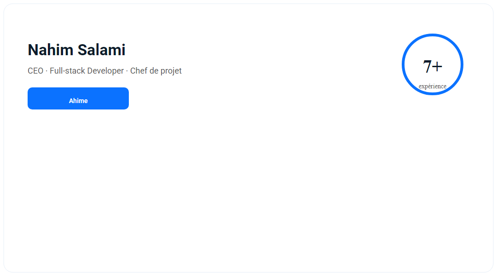
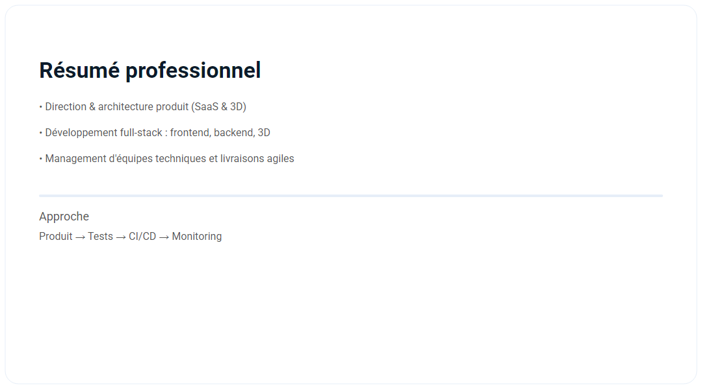
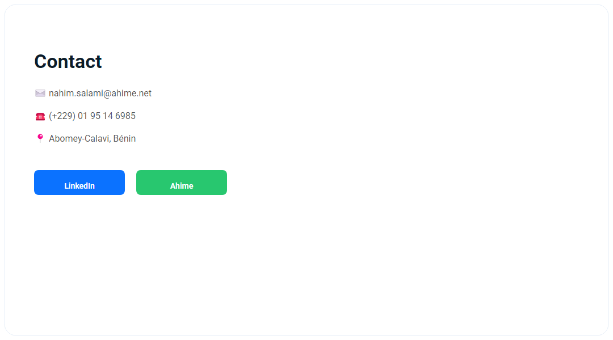
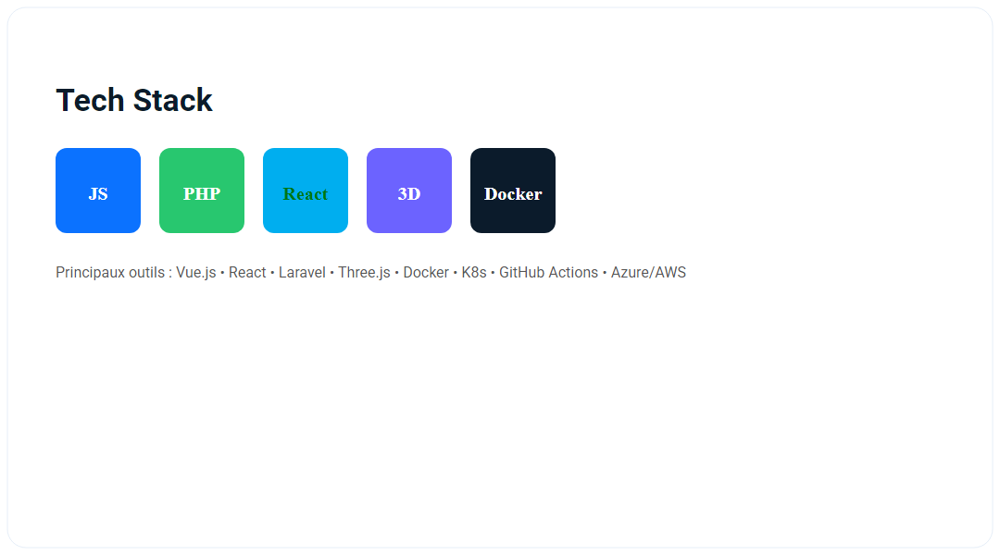
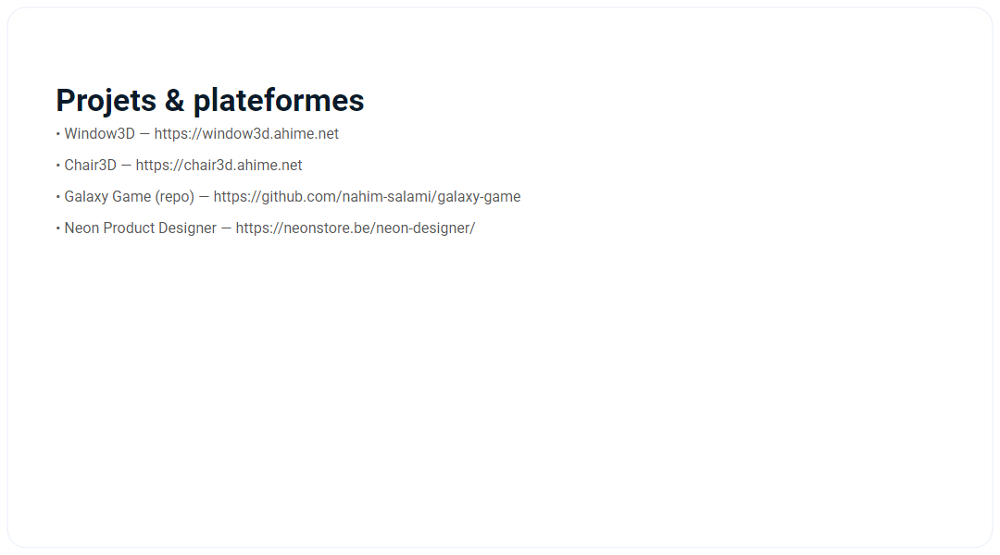
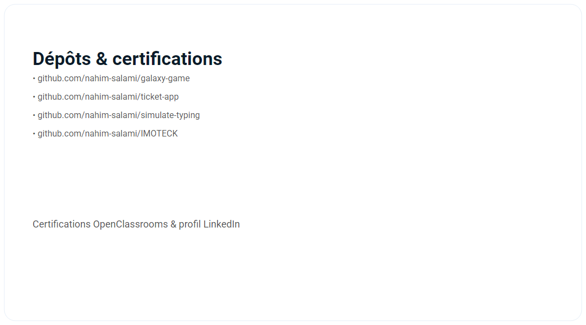
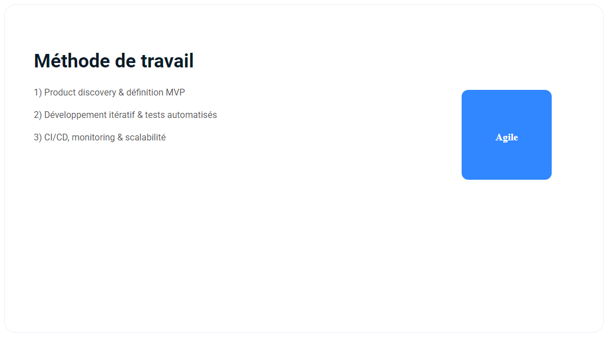
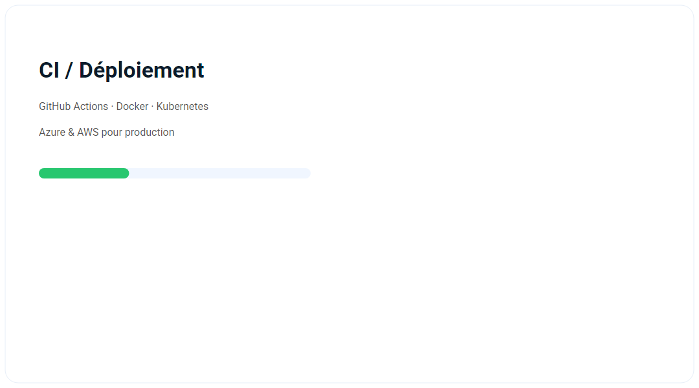
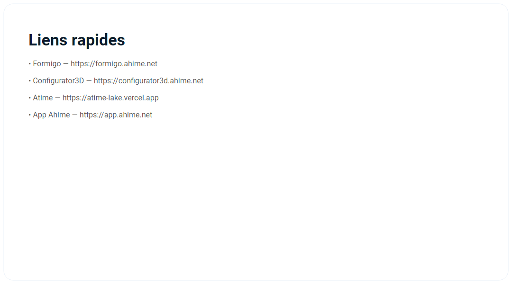

# 👋 Nahim Salami — CEO · Full-stack Developer · Chef de projet

  Développement web & mobile · SaaS · Configurateurs 3D · Architecture · Management

---

  <!-- Row 1 -->
   &nbsp;
   &nbsp;
  

  <!-- Row 2 -->
   &nbsp;
   &nbsp;
  

  <!-- Row 3 -->
   &nbsp;
   &nbsp;
  

  <!-- GitHub widgets externes -->
  
  &nbsp;
  

